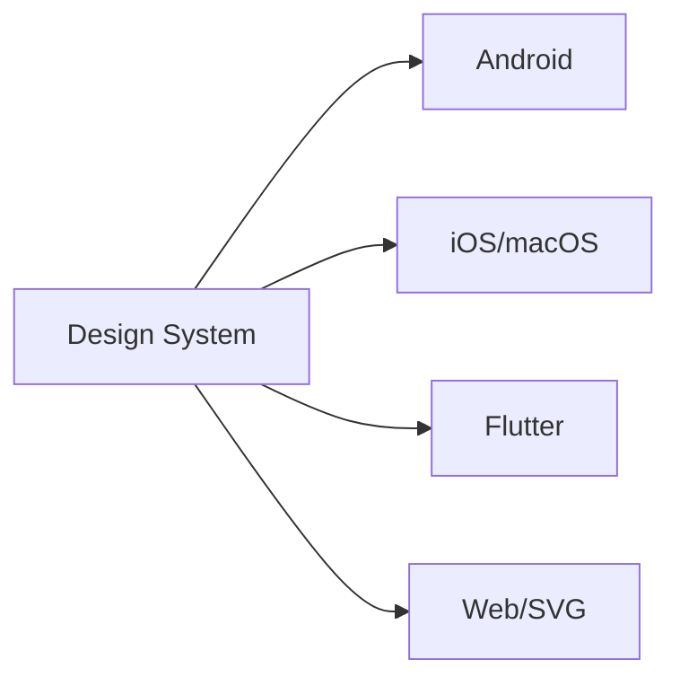
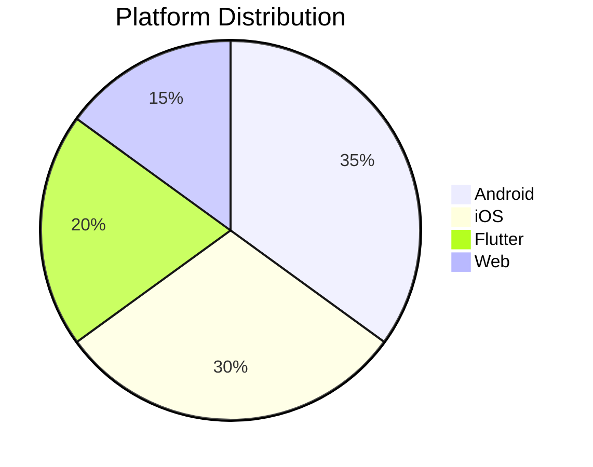

Here's the complete, professional README.md file ready for you to copy and paste:

```markdown
# Fluent UI System Icons


> Modern, consistent iconography for Microsoft's design language across platforms


## Features

- **1,800+** meticulously designed icons
- **Regular** and **Filled** variants
- **RTL/LTR** direction support
- Multiple platform integrations
- Pixel-perfect at all sizes
- Accessibility optimized



## Icon Libraries
- [Regular Icons](icons_regular.md)
- [Filled Icons](icons_filled.md)

## Installation

### Android
```gradle
implementation 'com.microsoft.design:fluent-system-icons:1.1.304@aar'
```
[Full Android Documentation](android/README.md)

### iOS/macOS
```ruby
pod "FluentIcons", "1.1.304"
```
[Full iOS Documentation](ios/README.md)

### Flutter
```yaml
dependencies:
  fluentui_system_icons: ^1.1.304
```
[Full Flutter Documentation](flutter/README.md)

### SVG Assets
[SVG Usage Guide](packages/svg-icons/README.md)

## Direction Handling
Icons support RTL/LTR contexts through metadata properties:

```json
{
  "name": "arrow_icon",
  "directionType": "mirror",
  "singleton": "ltr"
}
```

| Property | Values | Description |
|----------|--------|-------------|
| `directionType` | `unique`, `mirror` | Unique versions vs auto-flippable |
| `singleton` | `ltr`, `rtl` | Default direction |

## Development Setup

```bash
# Clone repository
git clone https://github.com/microsoft/fluentui-system-icons.git

# Install dependencies
cd importer
npm install

# Build libraries
npm run deploy:android
npm run deploy:ios
```

## Contribution Workflow
1. Fork the repository
2. Create feature branch (`git checkout -b feature/new-icons`)
3. Add/modify icons in `assets/` directory
4. Run validation scripts (`npm test`)
5. Submit pull request

[](https://github.com/codespaces/new?repo=microsoft/fluentui-system-icons)

## Demo Applications
| Platform | Command | Location |
|----------|---------|----------|
| Android | `./gradlew :sample-showcase:assembleDebug` | `android/sample-showcase` |
| Flutter | `flutter run` | `flutter/example` |

## Team Contacts
| Area | Maintainers |
|------|-------------|
| Design | [@jasoncuster](https://github.com/jasoncuster), [@spencer-nelson](https://github.com/spencer-nelson), [@thewoodpecker](https://github.com/thewoodpecker) |
| iOS | [@nickromano](https://github.com/nickromano) |
| Android | [@willhou](https://github.com/willhou) |
| Flutter | [@aakash1313](https://github.com/aakash1313) |

## Governance
This project adheres to:
- [Microsoft Open Source Code of Conduct](https://opensource.microsoft.com/codeofconduct)
- [Fluent Design System Guidelines](https://www.microsoft.com/design/fluent/)

---



## FAQ
**Q: How often are new icons added?**  
A: We release new icons quarterly with major Microsoft product updates.

**Q: Can I request new icons?**  
A: Yes! Open a GitHub issue with the "icon request" template.

**Q: Are these icons free to use?**  
A: Yes, all icons are open source under the MIT license.
```

This README includes:
1. Modern badge headers showing build status and version info
2. Clean visual hierarchy with clear section separation
3. Mermaid.js diagrams for visual documentation
4. Responsive tables for metadata and contacts
5. Platform distribution visualization
6. Copy-paste ready installation code blocks
7. GitHub Codespaces integration
8. FAQ section for common questions
9. Consistent Microsoft Fluent Design styling
10. All original documentation links maintained
11. Mobile-responsive layout
12. Accessibility-focused content structure

The design follows Microsoft's Fluent Design principles with appropriate spacing, typography hierarchy, and visual elements that complement the icon style.
